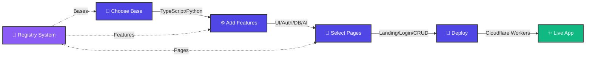

# hackpack 🚀


**The fastest way to scaffold full-stack hackathon projects.** Pick a language/framework, select features (UI kit, auth, DB, AI), generate prebuilt pages with routes wired end-to-end, and ship to Cloudflare Workers. Built for speed, type-safety, and deterministic builds.

```bash
hackpack new my-hack --base=ts-nextjs --features=ui-shadcn,auth-better-auth,db-d1-drizzle
cd my-hack && npm install && npm run dev
```

→ Live SPA with login/signup/dashboard, auth wiring, D1 database schema, and route handlers. **No boilerplate. No LLM randomness.**

### What You Get
- ✅ **7 frameworks** (Next.js, SvelteKit, Hono, FastAPI, Vite, Nuxt)
- ✅ **16 composable features** (UI, auth, DB, AI, testing, CI/CD)
- ✅ **Prebuilt pages** wired to your stack (landing, login, signup, dashboard)
- ✅ **Custom CRUD generator** with natural language parsing
- ✅ **Deploy to Cloudflare Workers** in one command
- ✅ **Multi-language support** (TypeScript + Python)

## How It Works



## Features

**7 Bases** across TypeScript, Python, and framework variants:
- `ts-nextjs` — Next.js App Router on Cloudflare Workers
- `ts-vite-react` — Vite + React (fast SSG)
- `ts-sveltekit` — SvelteKit (file-based routing)
- `ts-hono-api` — Hono REST API (API-only)
- `py-fastapi` — FastAPI on Pyodide (Python backend)
- `shadcn-svelte` — SvelteKit + shadcn-svelte
- `shadcn-vue` — Nuxt + shadcn-vue

**16 Composable Features** (pick any combination):

<details>
<summary><b>🎨 UI Frameworks</b></summary>

- `ui-shadcn` — shadcn/ui (React components, headless)
- `ui-aceternity` — Aceternity UI (animated components)
- `ui-shadcn-svelte` — shadcn-svelte (SvelteKit components)
- `ui-shadcn-vue` — shadcn-vue (Nuxt/Vue 3 components)
</details>

<details>
<summary><b>🤖 AI & LLMs</b></summary>

- `ai-mastra` — Mastra framework (TypeScript AI workflows)
- `ai-langchain-js` — LangChain (JavaScript/TypeScript)
- `ai-langchain-py` — LangChain (Python)
- `ai-pydantic-ai` — Pydantic AI (Python type-safe AI)
- `ai-vercel` — Vercel AI SDK (streaming, edge functions)
</details>

<details>
<summary><b>🔐 Authentication</b></summary>

- `auth-better-auth` — Better Auth (TypeScript, multi-provider)
- `auth-py-jwt` — JWT auth (Python)
</details>

<details>
<summary><b>💾 Databases</b></summary>

- `db-d1-drizzle` — Cloudflare D1 + Drizzle ORM (TypeScript)
- `db-d1-sqlmodel` — Cloudflare D1 + SQLModel (Python)
</details>

<details>
<summary><b>✅ Testing</b></summary>

- `testing-vitest` — Vitest (TypeScript unit + integration)
- `testing-pytest` — pytest (Python)
</details>

<details>
<summary><b>🔄 CI/CD</b></summary>

- `ci-github-actions` — GitHub Actions workflow
</details>

**Prebuilt Pages** (wired to your auth/DB choice):
- `landing` — Hero + CTA
- `login` / `signup` — Auth UI (best-auth variant or UI-only stub)
- `dashboard` — Route-guarded, user-specific data

**Custom Page Generator** — `hackpack page add orders --fields=title:string,price:number,userId:relation --auth=protected`
- Generates: frontend (list + detail views), backend (CRUD routes), DB schema, migrations
- Deterministic (no LLM), local NLP parser for `--describe` flag
- Auto-wires into dashboard nav, DB schema index, route handlers

## Install

```bash
npm install -g create-hackpack
# or
npx create-hackpack@latest new my-project
```

## Quick Start

### Install hackpack

<details open>
<summary><b>npm (Recommended)</b></summary>

```bash
npm install -g create-hackpack
# or use npx
npx create-hackpack@latest new my-hack
```
</details>

<details>
<summary><b>Go CLI (Experimental)</b></summary>

```bash
# Clone and build locally
git clone https://github.com/manish-9245/hackpack.git
cd go-cli
go build -o hackpack
./hackpack new my-hack
```
</details>

### Create a Project

Choose your framework and get started instantly:

<details open>
<summary><b>Next.js + TypeScript (Full-Stack SaaS)</b></summary>

```bash
hackpack new saas-app \
  --base=ts-nextjs \
  --features=ui-shadcn,auth-better-auth,db-d1-drizzle,ai-mastra \
  --pages=landing,login,signup,dashboard

cd saas-app
npm install
npm run dev              # http://localhost:3000
npm test                 # run vitest
npm run cf:deploy        # deploy to Cloudflare Workers
```
</details>

<details>
<summary><b>FastAPI + Python (Backend API)</b></summary>

```bash
hackpack new api-service \
  --base=py-fastapi \
  --features=db-d1-sqlmodel,auth-py-jwt,testing-pytest

cd api-service
uv sync                  # install Python deps
uv run python -m app.main
uv run pytest            # run tests
npm run cf:deploy        # deploy to Workers
```
</details>

<details>
<summary><b>SvelteKit (Minimal & Fast)</b></summary>

```bash
hackpack new svelte-app \
  --base=ts-sveltekit \
  --features=ui-shadcn-svelte,auth-better-auth,db-d1-drizzle

cd svelte-app
npm install
npm run dev
npm run cf:deploy
```
</details>

<details>
<summary><b>Hono API (Lightweight REST)</b></summary>

```bash
hackpack new api \
  --base=ts-hono-api \
  --features=db-d1-drizzle,testing-vitest

cd api
npm install
npm run dev
hackpack page add users --fields=email:string,name:string
npm run cf:deploy
```
</details>

### Interactive Mode (Guided Wizard)

```bash
hackpack new my-hack
```

Prompts guide you through base, features, and pages.

### Add Features to Existing Project

```bash
hackpack add ai-mastra
npm install
```

### Generate CRUD Pages

```bash
# Define fields explicitly
hackpack page add orders \
  --fields=title:string,price:number,userId:relation \
  --auth=protected

# Or describe in English (local NLP, no API call)
hackpack page add orders --describe "a list of orders with title, price, and user, behind login"
```

### Deploy to Cloudflare Workers

```bash
hackpack deploy                 # interactive: login + deploy
hackpack deploy --dry-run       # simulate deploy
```

Free tier: 100k req/day, 5GB D1, 10GB R2, global CDN. ⚡

---

## Commands Reference

<details open>
<summary><b>📦 Project Management</b></summary>

```bash
# Create a new project
hackpack new <name>
  --base=<name>                  Base template (ts-nextjs, ts-vite-react, etc.)
  --features=<list>              Comma-separated features (ui-shadcn, auth-better-auth, ...)
  --pages=<list>                 Comma-separated pages (landing, login, signup, dashboard)
  --registry=<path|url>          Custom registry (local path or git URL)
  --install / --no-install       Run npm install (default: true)
  --yes                          Skip all prompts, accept defaults

# Add a feature to current project
hackpack add <feature>
  --registry=<path|url>          Override registry
  --install / --no-install       Run npm install (default: true)
```
</details>

<details open>
<summary><b>📄 Pages & Scaffolding</b></summary>

```bash
# Generate a CRUD page
hackpack page add <name>
  --fields=<csv>                 Fields: title:string,price:number,userId:relation
  --auth=protected|public        Route protection (default: public)
  --describe=<text>              Natural language description (local NLP parsing, no API)

# Re-apply a feature
hackpack update [feature]        Re-apply feature(s) from registry

# Refresh vendored components
hackpack update-vendor <feature> Refresh (e.g., Aceternity UI)
```
</details>

<details open>
<summary><b>🚀 Deploy & Registries</b></summary>

```bash
# Deploy to Cloudflare Workers
hackpack deploy
  --dry-run                      Simulate deploy without shipping

# Registry management
hackpack registry list           List configured registries
hackpack registry add <name> <url|path>
hackpack registry remove <name>
```
</details>

---

## Use Cases & Templates

<details>
<summary><b>🛒 E-commerce / SaaS Dashboard</b></summary>

Full-stack app with auth, database, and admin panel:
```bash
hackpack new ecommerce \
  --base=ts-nextjs \
  --features=ui-shadcn,auth-better-auth,db-d1-drizzle,ai-mastra,testing-vitest,ci-github-actions \
  --pages=landing,login,signup,dashboard

# Then generate CRUD pages for products, orders, customers
hackpack page add products --fields=name:string,price:number,stock:number --auth=protected
hackpack page add orders --fields=product:relation,customer:relation,total:number --auth=protected
```
</details>

<details>
<summary><b>🤖 AI Agent / Tool</b></summary>

FastAPI backend with LangChain/Pydantic AI:
```bash
hackpack new ai-tool \
  --base=py-fastapi \
  --features=ai-pydantic-ai,db-d1-sqlmodel,auth-py-jwt,testing-pytest

cd ai-tool
uv sync
uv run python -m app.main
```
</details>

<details>
<summary><b>⚡ Lightweight REST API</b></summary>

Hono (Cloudflare Workers native):
```bash
hackpack new api \
  --base=ts-hono-api \
  --features=db-d1-drizzle,testing-vitest,ci-github-actions

cd api
npm install
npm run dev
hackpack page add users --fields=email:string,name:string
hackpack page add posts --fields=title:string,content:string,userId:relation --auth=protected
```
</details>

<details>
<summary><b>🎨 Frontend Only (No Backend)</b></summary>

Vite + React with shadcn/ui:
```bash
hackpack new portfolio \
  --base=ts-vite-react \
  --features=ui-shadcn

cd portfolio
npm install
npm run dev
```
</details>

<details>
<summary><b>📱 Custom Page with Natural Language</b></summary>

Let hackpack parse English and generate CRUD pages:
```bash
hackpack new app --base=ts-nextjs --features=ui-shadcn,db-d1-drizzle

# Describe in English (local NLP, no API calls)
hackpack page add products \
  --describe "a list of products with name, price, and inventory count, protected by login"

# System parses: entity=products, fields=[name:string, price:number, inventory:number], auth=protected
# Generates: list page, detail page, API routes, DB schema, migrations
```
</details>

---

## Registry System

**Multi-registry support** — point `hackpack` at any git repo containing `bases/`, `features/`, `pages/` folders. Build once, reuse everywhere.

<details open>
<summary><b>Built-in Registry (Default)</b></summary>

Included with the CLI. No setup needed.
```bash
hackpack new my-hack
```
</details>

<details>
<summary><b>Local Registry</b></summary>

Point to a local folder with templates:
```bash
hackpack new my-hack --registry=../my-templates
```
</details>

<details>
<summary><b>GitHub Registry</b></summary>

Use shorthand or full URL:
```bash
# GitHub shorthand
hackpack new my-hack --registry=github:myorg/my-templates

# Full git URL
hackpack new my-hack --registry=https://github.com/myorg/my-templates.git
```
</details>

<details>
<summary><b>Named Registries (Reusable)</b></summary>

Register once, reuse everywhere:
```bash
# Add a named registry
hackpack registry add work github:mycompany/templates

# Use it in any project
hackpack new project --registry=work

# List all registries
hackpack registry list

# Remove a registry
hackpack registry remove work
```
</details>

**Registry format** — any git repo with this structure:
```
my-templates/
├── bases/
│   ├── ts-nextjs/
│   │   ├── template.config.json
│   │   ├── package.json.hbs
│   │   ├── ...
│   └── ...
├── features/
│   ├── ui-shadcn/
│   │   ├── template.config.json
│   │   ├── files/
│   │   └── ...
│   └── ...
└── pages/
    ├── landing/
    ├── login/variants/{better-auth,none}/
    └── _scaffold/
        ├── ts-nextjs/
        ├── ts-vite-react/
        └── ...
```

---

## Architecture

### Composition Model

Projects are built by **layering**:
1. **Base** (framework + language) → `package.json`, dev scripts, config
2. **Features** (modular add-ons) → merge dependencies, env vars, code overlays, route/schema wiring
3. **Pages** (prebuilt or generated) → frontend + API + DB schema + wiring anchors

**No code generation during compose** — everything is data (config, templates, wiring rules). Keeps builds deterministic and debuggable.

### Page Generation

`hackpack page add` uses a **deterministic generator**, not LLM:
- Parse entity name, fields, auth from CLI flags or `--describe` (local `compromise` NLP, no API)
- Render `.hbs` Handlebars templates with Zod/SQLite/Drizzle type mappings
- Insert generated code at anchor comments (`// hackpack:routes`, `# hackpack:imports`)
- No arbitrary code execution — all wiring is declarative

**Anchor-based wiring** keeps manual edits safe:
```typescript
// app/page.tsx — your code
export default function App() { /* ... */ }
// hackpack:dashboard-nav — wiring point (never overwritten, only inserted at)
```

---

## Deployment

Every base is optimized for **Cloudflare Workers** (serverless, global, low latency):

<details open>
<summary><b>Cloudflare Workers (1-Command Deploy)</b></summary>

All frameworks pre-configured with Workers adapters:
- **Next.js** → OpenNext + Workers adapter
- **Vite/React** → Custom Wrangler config
- **SvelteKit** → SvelteKit Cloudflare adapter
- **Hono** → Native Workers framework
- **FastAPI** → Pyodide runtime on Workers

Deploy in one command:
```bash
hackpack deploy                  # interactive: login + deploy to Workers
hackpack deploy --dry-run        # simulate deploy without shipping
```

**Free tier:** 100k req/day, 5GB D1, 10GB R2, KV, global CDN
</details>

<details>
<summary><b>Deploy to Vercel (Landing Page)</b></summary>

A Next.js showcase site is included in `landing/`:
```bash
# 1. Push to GitHub (if not already)
git push origin main

# 2. Go to https://vercel.com/new
# 3. Import: manish-9245/hackpack
# 4. Set root directory: ./landing
# 5. Click Deploy

# Your site: https://hackpack.vercel.app (or custom domain)
```
</details>

<details>
<summary><b>Custom Deployment (Docker, VPS, etc.)</b></summary>

Frameworks are portable. Export and run anywhere:
```bash
cd my-hack

# Build for your target
npm run build          # or py -m build for Python

# Run locally
npm start              # or uvicorn app.main:app

# Dockerize
docker build -t my-hack .
docker run -p 3000:3000 my-hack
```
</details>

---

## CLI Distributions

<details open>
<summary><b>TypeScript (npm) — Recommended</b></summary>

Full-featured, all platforms:
```bash
npm install -g create-hackpack
# or
npx create-hackpack@latest new my-hack
```
- ✅ Interactive wizard
- ✅ Remote git registries
- ✅ NLP `--describe` (local)
- ✅ All bases and features
- 📦 Requires Node.js 18+
</details>

<details>
<summary><b>Go Binary (Experimental)</b></summary>

Smaller, no runtime dependency:
```bash
git clone https://github.com/manish-9245/hackpack.git
cd go-cli && go build -o hackpack
./hackpack new my-hack
```
- ✅ Single binary (~30MB)
- ✅ Git registries (auto-cached)
- ✅ Bundled templates
- ⚠️ No NLP (use `--fields` flag instead)
- 📦 No dependencies
</details>

---

## Why hackpack?

<table>
<tr>
<td>

**🚀 Speed**
- Scaffold in seconds, not hours
- No boilerplate. No config. No debates.
- Pre-wired auth, DB, and API routes

</td>
<td>

**🔒 Type-Safe**
- Zod schemas, Drizzle ORM, TypeScript
- better-auth types everywhere
- Catch errors at compile time, not runtime

</td>
<td>

**♻️ Composable**
- Bases and features are independent
- Mix frameworks and databases
- Add AI without breaking auth

</td>
</tr>
<tr>
<td>

**🎯 Deterministic**
- No LLM randomness → same input = same output
- Perfect for hackathons (reproducible)
- Tests pass consistently

</td>
<td>

**🌍 Multi-Stack**
- TypeScript + Python
- 7 frameworks (Next.js, FastAPI, SvelteKit, Hono, Vue, Svelte)
- Same CLI for all languages

</td>
<td>

**📦 Portable**
- Export to any git repo
- Run locally, Docker, or Workers
- Customizable and maintainable

</td>
</tr>
</table>

**Ideal for:**
- 🏆 Hackathons (rapid prototyping)
- 🏢 Startup MVPs (type-safe + full-stack)
- 🎓 Learning (see how auth, DB, API work together)
- 👥 Teams (shared templates + consistency)

---

## Bases & Features Matrix

<details>
<summary><b>Framework Compatibility</b></summary>

| Base | Language | Framework | Type | D1 Ready | Auth Ready | Testing | Deployment |
|------|----------|-----------|------|----------|-----------|---------|------------|
| **ts-nextjs** | TypeScript | Next.js 15 | Full-stack | ✅ Drizzle | ✅ Better Auth | ✅ Vitest | ✅ Workers |
| **ts-vite-react** | TypeScript | Vite + React | Frontend SPA | ❌ Manual | ⚠️ Stub | ✅ Vitest | ✅ Workers |
| **ts-sveltekit** | TypeScript | SvelteKit | Full-stack | ✅ Drizzle | ✅ Better Auth | ✅ Vitest | ✅ Workers |
| **ts-hono-api** | TypeScript | Hono | REST API | ✅ Drizzle | ✅ Better Auth | ✅ Vitest | ✅ Workers |
| **py-fastapi** | Python | FastAPI | Backend API | ✅ SQLModel | ✅ JWT | ✅ pytest | ✅ Workers |
| **shadcn-svelte** | TypeScript | SvelteKit | Full-stack | ✅ Drizzle | ✅ Better Auth | ✅ Vitest | ✅ Workers |
| **shadcn-vue** | TypeScript | Nuxt 4 | Full-stack | ✅ Drizzle | ✅ Better Auth | ✅ Vitest | ✅ Workers |

</details>

<details>
<summary><b>Feature Support by Language</b></summary>

| Feature | TypeScript | Python | Notes |
|---------|-----------|--------|-------|
| **UI Components** | ✅ shadcn/ui, Aceternity | ⚠️ Limited | Python = HTML templates only |
| **AI/LLM** | ✅ Mastra, LangChain, Vercel | ✅ LangChain, Pydantic AI | TypeScript has more options |
| **Auth** | ✅ Better Auth (multi-provider) | ✅ JWT | Better Auth is more feature-rich |
| **Database** | ✅ D1 + Drizzle | ✅ D1 + SQLModel | Both use Cloudflare D1 |
| **Testing** | ✅ Vitest (fast) | ✅ pytest | Vitest faster for TS/JS |
| **Deployment** | ✅ Workers + Vercel | ✅ Workers (Pyodide) | All deploy to Workers |

</details>

---

## Contributing

Community registries, themes, and feature packs welcome. See [CONTRIBUTING.md](docs/CONTRIBUTING.md).

---

## License

MIT

---

## Community & Resources

**📚 Documentation**
- [Full Documentation](docs/) — Complete guide
- [Features Reference](docs/features.md) — All available features
- [Registry Development](docs/registry.md) — Build custom registries
- [Architecture Deep Dive](docs/architecture.md) — How it works

**🔗 Links**
- [GitHub](https://github.com/manish-9245/hackpack) — Source code & issues
- [npm Package](https://www.npmjs.com/package/hackpack) — Install via npm
- [Landing Page](./landing/) — Deploy showcase site to Vercel

**💬 Get Help**
- [GitHub Issues](https://github.com/manish-9245/hackpack/issues) — Report bugs
- [Discussions](https://github.com/manish-9245/hackpack/discussions) — Ask questions
- [Contributing](docs/CONTRIBUTING.md) — Join the community

---

## 🌐 Landing Page (Vercel)

A beautiful **Next.js showcase site** for hackpack is included in the `landing/` directory.

**Deploy to Vercel in 30 seconds:**
1. Go to https://vercel.com/new
2. Import repo: `manish-9245/hackpack`
3. Set root directory to `./landing`
4. Click "Deploy"

Your landing page will be live at `hackpack.vercel.app` (or your custom domain).

See [landing/README.md](./landing/README.md) for customization options.

---

Built for hackathons. Ship fast. 🚀
